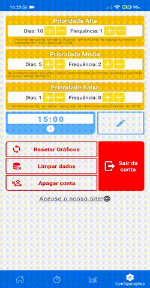

<h1 align="center">
    
    
By students, for students

</h1>

# 📱 About

IsCool is a mobile application for students looking for a good organization tool for their studies. It's excellent at helping students get organized, increase focus on studies, provide full control over activities and subjects, provide complete feedback on their studies, and much more! Access the [IsCool Website](https://sites.google.com/view/iscool/p%C3%A1gina-inicial?authuser=0) to download the application.

## 🚀 Technologies:

* React Native;

* Firebase;

* Google Authentication.

---
    
## 🏠 Screen Home

This is the main screen of the application. Through it, the user will be able to visualize his subjects of the day, his pending activities and will still have a graphic reference to the pending tasks of the next 7 days.

    

---

## ⏲️ Screen Timer

Here the user can time their study periods, set study goals and even use the Pomodoro technique to study.

    

---

## 📊 Screen Statistics

This screen brings together different graphs of different styles to give the user detailed feedback on, for example: pending tasks, time studied, goals met, etc.

    

---

## ⚙️ Screen Settings

Here, the user can configure the antecedence and frequency of each priority level of notifications, delete the account, remove data, reset the graphs, log out of the account and access the IsCool website.

    

---

## 🧰 Various Features

* Complete account system;

   * Creation;

   * Exclusion;

   * Password recovery;

* Storage of data remotely;

* Animations;

* Notifications;

* Dynamic graphics.

    
    
    

